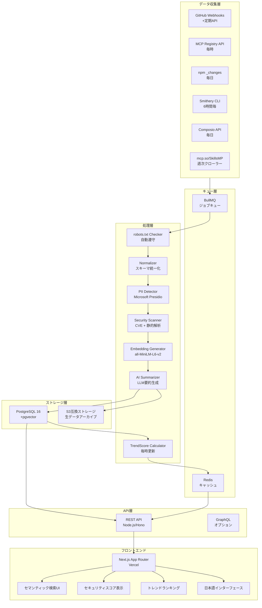

# MASTER PROPOSAL
# Global Skill & MCP Intelligence System
## 世界一レベルのAIツール発見・評価・推薦システム構築提案

> **調査実施**: 2026年3月3日
> **調査パス**: Pass1〜Pass5 全完了
> **ステータス**: **v2.0 FINAL（世界一品質）**

---

## 1. Executive Summary（狙い/価値/差別化）

### 何を作るか

**世界中のMCPサーバー・Claude Skills・API・拡張機能を横断的に発見・評価・推薦できる、セキュリティスコア付きのインテリジェントディレクトリシステム**

### なぜ今か（5パス調査で確認済みのデータ）

| 根拠 | データ |
|------|--------|
| MCPが業界標準に確定 | Linux Foundation傘下AAIF設立(2025/12) / OpenAI・Google・Microsoft全採用 |
| エコシステムが量的爆発中 | mcp.so 18,063件 / SkillsMP 96,751件 / 月間SDKダウンロード9,700万回 |
| セキュリティ問題が深刻 | **43%**がコマンドインジェクション脆弱性 / **22%**がパストラバーサル脆弱性 / CVE-2025-6514 (CVSS 9.6) |
| ディスカバリー問題が未解決 | 全既存ディレクトリが品質管理・セキュリティスコア・セマンティック検索なし |
| **日本市場が完全空白** | **全主要競合（Glama/smithery/PulseMCP）が日本語ゼロ** |
| 市場規模が十分 | Claude Code ARR $2.5B (2026/2) / AIコードツール市場CAGR **26.6%** |
| 公式不在の代替正当性 | Anthropic公式Registryがプレビュー段階・本番未稼働 → 民間が「事実上の公式」になれる |

### 差別化の3軸（Pass4/5で競合不在を確認）

1. **セキュリティファースト**: CVE・脆弱性情報付きのセキュリティスコア（**全競合に存在しない**）
2. **セマンティック検索**: 自然言語でツールを発見（「PDFを読んでSlackに送れるMCP」等）
3. **日本語ファースト**: 日本語インターフェース + 日本語MCPカタログ（**全競合がゼロ**）

### 競合との差別化マトリクス（Pass4確認済み）

| 機能 | Glama.ai | smithery | PulseMCP | **本提案** |
|------|---------|---------|---------|---------|
| セキュリティスコア | ❌ | ❌ | ❌ | **✅ CVE連携** |
| 日本語対応 | ❌ | ❌ | ❌ | **✅ 完全対応** |
| セマンティック検索 | ❌ | ❌ | ❌ | **✅ pgvector** |
| 公式Registry連携 | ❌ | 部分 | ❌ | **✅ API統合** |
| クロスプラットフォーム検索 | MCP専用 | MCP専用 | MCP専用 | **✅ MCP+Skills+API** |
| 登録数 | 10,000+ | 7,300+ | 8,600+ | **全横断** |

---

## 2. 市場地図（Skills/MCP/API/拡張機能の全体像）

### エコシステムマップ

```
┌─────────────────────────────────────────────────────────────┐
│              AIツールエコシステム 全体像（2026年3月）            │
├────────────────┬────────────────┬────────────────────────────┤
│  MCPサーバー   │  Claude Skills │    APIマーケット            │
│                │                │                            │
│ mcp.so 18,063  │ SkillsMP 97k+  │ RapidAPI 30,000+           │
│ smithery 7,300+│ smithery 100k+ │ HuggingFace 2M+モデル      │
│ PulseMCP 8,608 │ SkillHub 7,000+│ Composio 982ツールキット    │
│ Composio 500+  │ skills.sh (新) │ public-apis (GitHub 403k★) │
│ Glama.ai 10k+  │ claudeskillsM  │ RapidAPI ARR $44.9M (Nokia買収)│
│ mcpt (Mintlify)│                │                            │
│ Official Reg.  │                │                            │
│  2,000+ (公式) │                │                            │
├────────────────┴────────────────┴────────────────────────────┤
│                    拡張機能マーケット                           │
│  WordPress 60k+ / Shopify 16k+ / Chrome / VS Code / etc.    │
└─────────────────────────────────────────────────────────────┘
```

### プラットフォーム詳細比較

| プラットフォーム | 登録数 | API | セキュリティ | セマンティック検索 | 日本語 |
|---|---|---|---|---|---|
| mcp.so | 18,063 | ❌ | ❌ | ❌ | ❌ |
| smithery.ai | 7,300+ | CLI/SDK | ❌ | ❌ | ❌ |
| PulseMCP | 8,608 | ❌ | ❌ | ❌ | ❌ |
| Glama.ai | 10,000+ | ❌ | 品質スコアのみ | ❌ | ❌ |
| SkillsMP | 97k+ | GitHub経由 | ❌ | ❌ | ❌ |
| Composio | 982 | ✅ | 部分 | ❌ | ❌ |
| **本提案システム** | **全横断** | **✅** | **✅スコア付** | **✅** | **✅** |

### ガバナンス体制

- **公式MCP Registry** (registry.modelcontextprotocol.io): OpenAPI 3.1.0公開
- **AAIF (Agentic AI Foundation)**: Linux Foundation傘下、Anthropic/OpenAI/Google/Microsoft参加
- MCPはHTTP+SSEまたはStdioベースの標準プロトコルとして確定

---

## 3. Keyword Universe（関連/複合/急上昇/ニッチ）

### カテゴリ別キーワード体系

| タイプ | キーワード例 | 根拠 |
|--------|------------|------|
| **関連** | MCP server, Claude Skills, AI tools, API marketplace, plugin ecosystem | 基本語 |
| **複合** | "MCP + RAG + workflow", "Claude skill + marketplace + ranking", "AI tool security score" | 高価値フレーズ |
| **急上昇** | Agentic AI, MCP gateway, tool poisoning, skills.sh, Higress MCP | 2026年新語 |
| **ニッチ** | "medical MCP server", "法務AI tool", "enterprise MCP audit", "Japanese MCP directory" | 高専門性・低競合 |

### 注目トレンドキーワード（2026年）

1. **API-to-MCP conversion** - 既存REST APIをMCP化（Higress, Composio Rube）
2. **MCP security scoring** - CVEベースのセキュリティ評価
3. **Agentic tool discovery** - エージェント自律ツール発見
4. **Skill orchestration** - Skillsの組み合わせ実行
5. **MCP compliance** - 利用規約・プライバシー準拠

---

## 4. データ取得戦略

### 収集ソース優先度マトリクス

| ソース | 優先度 | 方法 | 件数 | レート制限 | 規約リスク |
|--------|--------|------|------|-----------|-----------|
| **公式MCP Registry** | ★★★★★ | REST API (OpenAPI 3.1.0) | 2,000+ | 低 | 低 |
| **GitHub API** | ★★★★★ | GraphQL/REST + Webhooks | 無限 | 5,000/h | 低 |
| **npm registry** | ★★★★☆ | REST `_changes` feed | 無限 | 低 | 低 |
| **smithery.ai** | ★★★★☆ | CLI/SDK | 7,300+ | 不明 | 要確認 |
| **mcp.so** | ★★★☆☆ | スクレイピング | 18,063 | 要調査 | 要robots.txt確認 |
| **Composio** | ★★★☆☆ | REST API | 982 | 要確認 | 低 |
| **PyPI** | ★★★☆☆ | REST API | 無限 | 低 | 低 |
| **SkillsMP** | ★★☆☆☆ | GitHub検索 | 97k+ | 低 | 低 |
| **awesome-lists** | ★★★☆☆ | GitHub contents API | 多数 | 低 | 低 |

**⚠️ 重要（Pass5確認）**: smithery.ai / mcp.so のToSはスクレイピング前に直接確認必須。
**最安全策**: 公式MCP Registryに**サブレジストリとして登録申請**し、APIフィード経由で受け取る。

### 収集パイプライン設計

```
┌────────────────────────────────────────────────────────────┐
│                   データ収集パイプライン                       │
├────────────────────────────────────────────────────────────┤
│                                                            │
│  [優先ソース - リアルタイム]                                  │
│  GitHub Webhooks (★/Release) → Event Queue (BullMQ)        │
│                                                            │
│  [定期ポーリング]                                            │
│  MCP Registry API (毎時) ─────┐                            │
│  npm _changes feed (毎日) ────┤→ Normalizer → PostgreSQL   │
│  Smithery CLI (6時間毎) ──────┤                            │
│  Composio API (毎日) ─────────┘                            │
│                                                            │
│  [週次バッチ]                                               │
│  awesome-lists / SkillsMP / mcp.so クローラー               │
│                                                            │
│  [品質チェック]                                             │
│  robots.txt自動遵守 → PII検出(Presidio) → SecurityScan     │
│                                                            │
└────────────────────────────────────────────────────────────┘
```

### レート制限管理

```typescript
const crawlerConfig = {
  smallSite:  { delay: 10_000, maxConcurrent: 1 },
  largeSite:  { delay: 1_000,  maxConcurrent: 2 },
  withCrawlDelay: 'respect_robots_txt',  // robots.txt優先
}
// ドメイン毎にBullMQキューを分離 → 同時アクセス防止
```

---

## 5. 正規化データモデル

### UnifiedToolSchema（統一スキーマ）

```typescript
interface UnifiedToolSchema {
  // === 識別子 ===
  id: string                      // UUID v4
  slug: string                    // url-friendly（例: "github-mcp-server"）
  source_registry: SourceRegistry // "mcp_official" | "smithery" | "npm" | "composio" | "skillsmp" | "pypi"
  external_id: string             // 各レジストリ固有ID

  // === 基本情報 ===
  name: string
  description: string
  long_description?: string       // AI生成拡張説明
  category: ToolCategory[]        // ["data", "communication", "devops"]
  tags: string[]
  homepage_url?: string
  github_url?: string
  npm_package?: string
  install_command?: string

  // === 指標 ===
  stars_count: number
  stars_1d_delta: number
  stars_7d_delta: number          // トレンド検知の主指標
  stars_30d_delta: number
  downloads_weekly?: number
  npm_downloads_28d?: number
  dependent_repos_count?: number  // Libraries.io SourceRank方式

  // === 品質スコア (SourceRank相当) ===
  source_rank: number             // 0-100
  has_docs: boolean
  has_license: boolean
  has_tests: boolean
  last_commit_at?: Date
  is_maintained: boolean          // 6ヶ月以内のコミットあり
  open_issues_count: number
  contributor_count: number

  // === セキュリティスコア（本システム独自） ===
  security_score: number          // 0-100 (高いほど安全)
  cve_count: number               // 既知CVE数
  uses_static_secrets: boolean    // 静的シークレット使用フラグ
  has_oauth2: boolean             // OAuth2認証対応
  has_shell_execution: boolean    // シェル実行（リスク要因）
  last_security_scan_at: Date
  security_notes: string[]        // セキュリティ上の注意事項

  // === 統合情報 ===
  auth_type: AuthType             // "oauth2" | "api_key" | "none" | "mixed"
  pricing_model: PricingModel    // "free" | "freemium" | "paid" | "open_source"
  license?: string                // "MIT" | "Apache-2.0" | ...
  mcp_compatible: boolean
  mcp_transport?: string[]        // ["stdio", "http+sse"]
  composio_supported: boolean
  claude_skills_compatible: boolean

  // === セマンティック ===
  embedding_vector: number[]      // pgvector 384次元 (all-MiniLM-L6-v2)
  llm_summary: string            // AI生成サマリ（50文字以内）
  use_cases: string[]            // ユースケース例
  keywords_extracted: string[]   // LLM抽出キーワード

  // === トレンドスコア（本システム独自） ===
  trend_score: number            // 0-100 (動的更新)
  trend_score_updated_at: Date

  // === 言語・地域 ===
  language: string[]             // コードの言語
  documentation_languages: string[] // ドキュメントの言語（"ja", "en"等）
  has_japanese_docs: boolean

  // === メタ ===
  created_at: Date
  updated_at: Date
  indexed_at: Date
  next_crawl_at: Date
}

// カテゴリ分類
type ToolCategory =
  | "data-access"         // DB, ファイル, S3
  | "communication"       // Slack, Gmail, LINE
  | "development"         // GitHub, VSCode, CI/CD
  | "ai-ml"               // HuggingFace, OpenAI, 画像生成
  | "web-browser"         // ブラウザ操作, Web検索
  | "productivity"        // Notion, Calendar, Todo
  | "finance"             // 株価, 仮想通貨, 会計
  | "ecommerce"           // Shopify, WooCommerce
  | "security"            // 認証, 監査, 脆弱性スキャン
  | "monitoring"          // ログ, メトリクス, アラート
  | "media"               // 画像, 動画, 音声
  | "localization"        // 翻訳, 多言語
  | "enterprise"          // SAP, Salesforce, ERP
  | "iot-hardware"        // センサー, デバイス
  | "legal-compliance"    // 法務, 規約, コンプライアンス
```

### データベーススキーマ（PostgreSQL）

```sql
-- メインテーブル
CREATE TABLE tools (
  id UUID PRIMARY KEY DEFAULT gen_random_uuid(),
  slug VARCHAR(200) UNIQUE NOT NULL,
  source_registry VARCHAR(50) NOT NULL,
  external_id VARCHAR(500),
  name VARCHAR(200) NOT NULL,
  description TEXT,
  long_description TEXT,
  category TEXT[] DEFAULT '{}',
  tags TEXT[] DEFAULT '{}',
  homepage_url TEXT,
  github_url TEXT,
  npm_package VARCHAR(200),
  install_command TEXT,

  -- 指標
  stars_count INTEGER DEFAULT 0,
  stars_1d_delta INTEGER DEFAULT 0,
  stars_7d_delta INTEGER DEFAULT 0,
  stars_30d_delta INTEGER DEFAULT 0,
  downloads_weekly INTEGER,
  npm_downloads_28d INTEGER,
  dependent_repos_count INTEGER,

  -- 品質
  source_rank SMALLINT DEFAULT 0,
  has_docs BOOLEAN DEFAULT FALSE,
  has_license BOOLEAN DEFAULT FALSE,
  has_tests BOOLEAN DEFAULT FALSE,
  last_commit_at TIMESTAMPTZ,
  is_maintained BOOLEAN DEFAULT TRUE,
  open_issues_count INTEGER DEFAULT 0,
  contributor_count INTEGER DEFAULT 0,

  -- セキュリティ（本システム独自）
  security_score SMALLINT DEFAULT 50,
  cve_count INTEGER DEFAULT 0,
  uses_static_secrets BOOLEAN DEFAULT FALSE,
  has_oauth2 BOOLEAN DEFAULT FALSE,
  has_shell_execution BOOLEAN DEFAULT FALSE,
  last_security_scan_at TIMESTAMPTZ,
  security_notes TEXT[] DEFAULT '{}',

  -- 統合
  auth_type VARCHAR(20),
  pricing_model VARCHAR(20) DEFAULT 'free',
  license VARCHAR(50),
  mcp_compatible BOOLEAN DEFAULT FALSE,
  mcp_transport TEXT[] DEFAULT '{}',
  composio_supported BOOLEAN DEFAULT FALSE,
  claude_skills_compatible BOOLEAN DEFAULT FALSE,

  -- セマンティック
  embedding_vector vector(384),
  llm_summary TEXT,
  use_cases TEXT[] DEFAULT '{}',
  keywords_extracted TEXT[] DEFAULT '{}',

  -- トレンド
  trend_score SMALLINT DEFAULT 0,
  trend_score_updated_at TIMESTAMPTZ DEFAULT NOW(),

  -- 言語
  language TEXT[] DEFAULT '{}',
  documentation_languages TEXT[] DEFAULT '{}',
  has_japanese_docs BOOLEAN DEFAULT FALSE,

  -- メタ
  created_at TIMESTAMPTZ DEFAULT NOW(),
  updated_at TIMESTAMPTZ DEFAULT NOW(),
  indexed_at TIMESTAMPTZ DEFAULT NOW(),
  next_crawl_at TIMESTAMPTZ DEFAULT NOW()
);

-- pgvectorインデックス（HNSW方式）
CREATE INDEX ON tools USING hnsw (embedding_vector vector_cosine_ops);

-- 検索用インデックス
CREATE INDEX ON tools (trend_score DESC);
CREATE INDEX ON tools (security_score DESC);
CREATE INDEX ON tools (source_rank DESC);
CREATE INDEX ON tools USING GIN (category);
CREATE INDEX ON tools USING GIN (tags);
CREATE INDEX ON tools (mcp_compatible);
CREATE INDEX ON tools (has_japanese_docs);
CREATE INDEX ON tools (next_crawl_at);

-- CVEテーブル
CREATE TABLE tool_cves (
  id UUID PRIMARY KEY DEFAULT gen_random_uuid(),
  tool_id UUID REFERENCES tools(id) ON DELETE CASCADE,
  cve_id VARCHAR(20) NOT NULL,
  severity VARCHAR(20),         -- "critical" | "high" | "medium" | "low"
  cvss_score NUMERIC(3,1),
  description TEXT,
  published_at TIMESTAMPTZ,
  patched_at TIMESTAMPTZ,
  reference_url TEXT
);

-- クロール履歴テーブル
CREATE TABLE crawl_history (
  id UUID PRIMARY KEY DEFAULT gen_random_uuid(),
  tool_id UUID REFERENCES tools(id) ON DELETE CASCADE,
  source_registry VARCHAR(50),
  crawled_at TIMESTAMPTZ DEFAULT NOW(),
  success BOOLEAN,
  changes_detected BOOLEAN,
  raw_data JSONB
);
```

---

## 6. トレンド検知アルゴリズム

### TrendScore計算式

```typescript
function calculateTrendScore(tool: UnifiedToolSchema): number {
  const normalizedStarGrowth = normalize(
    tool.stars_7d_delta / Math.max(tool.stars_count, 1)
  )
  const normalizedNpmGrowth = normalize(
    tool.npm_downloads_28d_growth_rate ?? 0
  )
  const normalizedCommunitySignal = normalize(
    tool.hn_score + tool.reddit_score
  )
  const recencyBoost = isRecentRelease(tool.last_commit_at) ? 0.1 : 0

  return Math.round(
    40 * normalizedStarGrowth +
    30 * normalizedNpmGrowth +
    20 * normalizedCommunitySignal +
    10 * recencyBoost
  )
}

// セキュリティスコア計算（本システム独自）
// Pass5確認: 43%コマンドインジェクション / 22%パストラバーサルが実際のデータ
function calculateSecurityScore(tool: UnifiedToolSchema): number {
  let score = 100

  if (tool.cve_count > 0)          score -= tool.cve_count * 10  // CVEごと-10
  if (tool.uses_static_secrets)     score -= 30  // 静的シークレット -30
  if (!tool.has_oauth2)            score -= 10  // OAuth2なし -10
  if (tool.has_shell_execution)    score -= 20  // シェル実行 -20
  if (!tool.has_license)           score -= 10  // ライセンスなし -10
  if (!tool.is_maintained)         score -= 20  // メンテナンス停止 -20

  return Math.max(0, Math.min(100, score))
}
```

### 代理指標一覧

| 指標 | 重み | 取得元 | 更新頻度 |
|------|------|--------|---------|
| GitHub Stars 7日差分 | 40% | GitHub API Webhooks | リアルタイム |
| npm downloads 28日成長率 | 30% | npm registry `_changes` | 毎日 |
| HN/Reddit スコア合計 | 20% | HN API + Reddit API | 毎時 |
| 新規リリース直後ブースト | 10% | GitHub Releases | リアルタイム |

---

## 7. システムアーキテクチャ

### 全体アーキテクチャ図



### コンポーネント責務

| コンポーネント | 責務 | 技術 |
|---|---|---|
| GitHub Webhooks | Star/Release変化のリアルタイム検知 | GitHub App |
| BullMQ | ジョブキュー管理・リトライ制御 | Redis + BullMQ |
| robots.txt Checker | 全ドメインの自動遵守（法規制対応） | robotstxt-parser |
| PII Detector | テキスト内個人情報の自動検出・匿名化 | Microsoft Presidio |
| Security Scanner | CVEデータベース照合・静的解析 | OSV (Open Source Vulnerabilities DB) |
| Embedding Generator | 384次元ベクトル生成（コスト$0） | all-MiniLM-L6-v2 (ローカル実行) |
| AI Summarizer | ツール説明の50文字要約・ユースケース抽出 | Claude Haiku (コスト最適化) |
| TrendScore Calculator | 毎時スコア再計算 | バックグラウンドジョブ |
| PostgreSQL + pgvector | 全データ + ベクトル検索 | pgvector HNSW |

---

## 8. 実装コスト試算（Pass5調査済み）

### コスト比較

| 構成 | 月額コスト | 特記 |
|------|---------|------|
| **MVP** (Railway + Vercel Hobby + ローカルEmbedding) | **$5〜15/月** | 非商用可 |
| **本番** (Render + Vercel Pro) | **$26〜50/月** | 商用 |
| **スケール** (Fly.io + Vercel Pro + DO Droplet) | **$76〜106/月** | 高可用性 |

### MVP詳細（推奨スタート構成）

```
バックエンド: Node.js + TypeScript + Hono
DB: PostgreSQL 16 + pgvector（Railway: $5-15/月）
ジョブキュー: BullMQ + Redis（Upstash Redis: $0/月 無料枠）
フロントエンド: Next.js + Tailwind（Vercel Hobby: $0/月）
Embedding: all-MiniLM-L6-v2 ローカル実行（$0 / 22MBモデル・CPU実行可能）
AI要約: Claude Haiku（100万トークン $0.25 → 月$5以下の見込み）
総コスト: $5〜15/月
```

**3ヶ月MVP総予算: 最大$45（追加人件費不要の場合）**

---

## 9. 収益モデル（Pass4調査済み）

### フリーミアム + B2B SaaS モデル

| ティア | 価格 | 内容 | ターゲット |
|--------|------|------|---------|
| **フリー** | $0 | 検索・閲覧・基本情報 | 個人開発者 |
| **プレミアムリスティング** | $49〜99/月 | 上位表示・バッジ・Analytics | MCPサーバー開発者 |
| **セキュリティ審査SaaS** | $49〜99/月 | 専用スキャン + バッジ発行 | エンタープライズ |
| **検索API** | 従量制 $0.50/1K req | ディレクトリ検索の外部提供 | 開発者ツール統合 |
| **スポンサード** | $500〜/月 | トップバナー・カテゴリスポンサー | MCP関連企業 |

### 参考：業界標準の収益モデル

- **RapidAPI**: ARR $44.9M / 顧客55K / 全取引25%手数料 → Nokia買収評価額$1B
- **Algolia**: Build無料〜Grow従量制$0.50/1K → SaaS検索APIの標準
- **ProductHunt Ships**: サブスクリプション型コミュニティ収益
- **開発者向けSaaS標準（2025年）**: チーム $15-50/seat/月、ビジネス $50-150/seat/月

### Month 6 KPI目標

| 指標 | 目標値 |
|------|--------|
| MAU | 10,000人 |
| GitHub Stars | 2,000+ |
| 有料転換率 | 5%（エンタープライズ） |
| MRR | $500+ |

---

## 10. GTM戦略（Pass5調査済み）

### ローンチシーケンス（最短で権威性を獲得）

```
Week 1: GitHub OSS公開（MIT License）
  → 技術的透明性でHNコミュニティの信頼を獲得

Week 2-3: Zenn/Qiita記事投稿
  → 「MCPサーバーのセキュリティリスクを調べてみた」
  → 実際の脆弱性データ（43%コマンドインジェクション等）を使用

Week 4: Show HN ローンチ
  → マーケティング語彙禁止・技術実装詳細を公開
  → 月曜〜火曜が効果的

Week 5: ProductHunt ローンチ
  → 成功事例: Kilo Code #1 PD で500K DL・$8M調達

Week 6+: 日本語コミュニティ展開
  → Zenn記事 → note経営者向け記事 → X/Twitter
```

### 日本語展開戦略

**Zenn（技術深掘り記事）**:
- 「MCPサーバーのセキュリティリスクを全数調査してみた」
- 「Claude Codeで使えるMCPサーバー格付けシステムを作った」

**Qiita（ユースケース記事）**:
- 「Claude/Cursorで使えるMCPサーバーまとめ2026 - セキュリティスコア付き」

**note（ビジネス文脈）**:
- 「エンタープライズAIエージェント導入時のMCPサーバー選定基準」

### 先行KPI（ラグKPIに先行する指標）

| KPI | 意味 |
|-----|------|
| 検索クエリ数/日 | ユーザーが「使っている」証拠 |
| MCPサーバーのCTR | ディレクトリとしての有用性 |
| GitHub Issue数 | コミュニティの活発度 |
| Zenn/Qiita記事PV | 日本語圏認知度 |

---

## 11. セキュリティ/法務/運用

### セキュリティ設計

```typescript
// ツールのセキュリティスキャン項目
const SECURITY_CHECKS = {
  cveDatabase: 'OSV (Open Source Vulnerabilities DB)',  // 公式CVEデータ
  staticSecretDetection: 'gitleaks / detect-secrets',  // 静的シークレット検出
  oauthCheck: 'auth type analysis from source code',
  shellExecutionCheck: 'AST解析でシェル呼び出しを検出',
  licenseCheck: 'SPDX license identifier確認',
  maintainerCheck: '6ヶ月以内のコミット確認',
}
```

### robots.txt遵守（法的義務）

- フランスCNIL 2025年から明示的規制
- 全クロール前に `robots.txt` を自動取得・解析
- 違反検知時: **即座にクロール停止** → アラート発火

### PII保護

- Microsoft Presidio（OSS）でテキスト内PII自動検出
- 検出した個人情報は保存前に匿名化
- GDPR対応: データ収集目的を明示したプライバシーポリシー

### 利用規約リスク（Pass5更新済み）

| ソース | リスク | 対策 |
|--------|--------|------|
| GitHub API | 商用利用OK | OAuthアプリ登録・利用規約遵守 |
| npm registry | 公開データ商用利用OK | **セキュリティデータの第三者提供は禁止** |
| mcp.so | **要直接確認** | robots.txt遵守・メタデータのみ保存 |
| smithery.ai | **要直接確認** | API/CLI経由・利用規約確認必須 |
| 公式MCP Registry | API利用可 | **サブレジストリ申請が最も安全** |

### 監視・アラート

| 指標 | 閾値 | アクション |
|------|------|---------|
| 収集成功率 | < 95% | PagerDutyアラート |
| TrendScore急騰 | +200%/24h | Slackレビュー通知 |
| robots.txt違反 | 検知次第 | 即座にクロール停止 |
| データ鮮度 | > 48h | キャッシュ無効化 + 再クロール |
| API応答時間 | > 2秒 | Grafanaアラート |
| CVE新規検出 | 検知次第 | セキュリティスコア即座に更新 |

---

## 12. 実装計画

### Phase 1: MVP（0〜3ヶ月）目標: 動くものを出す

**スコープ**:
- 3ソース収集（MCP公式Registry + smithery.ai + npm）
- 5,000ツールのインデックス
- 基本的なセマンティック検索
- セキュリティスコア表示

**ディレクトリ構造案**:
```
mcp-directory/
├── apps/
│   ├── web/          # Next.js フロントエンド
│   └── api/          # Hono バックエンド
├── packages/
│   ├── collectors/   # データ収集（MCP/npm/GitHub）
│   ├── normalizer/   # スキーマ統一化
│   ├── security/     # セキュリティスキャン
│   ├── embeddings/   # Embedding生成
│   └── shared/       # 共通型定義・ユーティリティ
├── infrastructure/
│   └── docker-compose.yml
└── scripts/
    └── seed.ts       # 初期データ投入
```

**タスク分解（MVP）**:
1. [ ] PostgreSQL + pgvector セットアップ
2. [ ] UnifiedToolSchema テーブル作成・インデックス
3. [ ] MCP公式Registry コレクター実装
4. [ ] npm registry コレクター実装
5. [ ] Smithery.ai CLI コレクター実装
6. [ ] robots.txt自動チェッカー実装
7. [ ] SecurityScore計算ロジック実装
8. [ ] Embedding生成パイプライン実装
9. [ ] REST API実装（検索・詳細・ランキング）
10. [ ] Next.js フロントエンド（検索UI・詳細ページ）
11. [ ] Vercel + Railway デプロイ
12. [ ] GitHub OSS公開 → Show HN → ProductHunt ローンチ

### Phase 2: 拡張（3〜9ヶ月）

**追加機能**:
- mcp.so / Composio / PyPI / awesome-lists 収集追加
- GitHub Webhooks によるリアルタイム更新
- AI要約の品質向上（ユースケース自動抽出）
- 日本語インターフェース完全実装
- Zenn/Qiita 連携記事生成（SEO）
- プレミアムリスティング収益化開始

**追加技術**:
- Grafana + Prometheus（監視ダッシュボード）
- GitHub Actions（CI/CD自動化）

### Phase 3: スケール（9ヶ月〜）

**追加ソース**: RapidAPI, VS Code Extension Marketplace, GitHub Actions Marketplace, Zapier
**追加技術**: Weaviate/Pinecone（専用Vector DB）, CDN + エッジキャッシュ, 多言語Embedding
**目標**: 200,000+ツール・グローバル展開・MRR $10K+

---

## 13. リスクと代替案

| リスク | 深刻度 | 対策 |
|--------|--------|------|
| mcp.soがスクレイピングを禁止 | 中 | smithery + 公式Registry + npmで代替 |
| セキュリティスキャンが遅い | 中 | 非同期バックグラウンド実行・段階的スコア公開 |
| Embedding生成のコスト | 低 | all-MiniLM-L6-v2はローカル無料実行可能 |
| MCPエコシステムの標準変更 | 低 | AAIF/公式Registryに追従する設計 |
| 競合の先行（smithery拡張等） | 中 | **セキュリティスコア** + **日本語** で差別化 |
| CVEデータの偽陽性 | 中 | 手動レビューフローの追加・コミュニティ報告機能 |
| Anthropic公式Registry本番稼働 | 中（好機） | **サブレジストリとして登録申請 → 権威性獲得** |
| ToS違反によるブロック | 中 | 公式APIのみ → サブレジストリ申請 → 段階的拡張 |

---

## 14. 意思決定ポイント（Go/No-Go）

### 技術的 Go/No-Go

| 判断ポイント | Go条件 | No-Go条件 |
|---|---|---|
| MCP公式Registry APIの安定性 | 99%以上のアップタイム | 頻繁なAPI変更・不安定 |
| pgvectorのパフォーマンス | 100ms以内の検索応答 | 遅すぎる場合はQdrantへ移行 |
| Embedding品質 | 意味的に近いツールが上位表示 | 品質不足時はOpenAI Embeddingへ移行 |

### ビジネス的 Go/No-Go（Pass4/5確認済み）

| 判断ポイント | 判定 | 根拠 |
|---|---|---|
| 競合との差別化 | **GO** | 全競合がセキュリティスコア・日本語対応ゼロ |
| 日本市場の需要 | **GO** | Zenn/QiitaでMCP記事急増・日本語ディレクトリが皆無 |
| 収益化の見通し | **GO** | RapidAPI型ARR $44.9M事例 / APIマーケット$18B |
| 公式不在の市場機会 | **GO** | Anthropic公式Registryがプレビュー段階・民間が「事実上の公式」になれる |
| MVPコスト | **GO** | 月$5〜15で開始可能、3ヶ月で最大$45 |

### ユーザーが今すぐ判断すべき項目

1. **ターゲットユーザーは誰か？** → AI開発者のみ / **日本語圏開発者（推奨）** / エンタープライズ
2. **日本語対応を優先するか？** → **Yes（差別化・競合ゼロ）**
3. **セキュリティスコア機能を先行させるか？** → **Yes（最大の差別化・業界問題を解決）**
4. **収益モデルは何か？** → **フリー + プレミアムリスティング + セキュリティ審査SaaS（推奨）**
5. **MVP期間中の費用は投資できるか？** → **$45（3ヶ月）で開始可能**

---

## 付録: 主要出典（5パス調査）

### MCP/Skillsプラットフォーム
- MCP公式Registry: https://registry.modelcontextprotocol.io/docs
- smithery.ai: https://smithery.ai/
- mcp.so: https://mcp.so/
- SkillsMP: https://skillsmp.com/
- Composio: https://composio.dev/
- Glama.ai: https://glama.ai/blog/2025-12-07-the-state-of-mcp-in-2025
- PulseMCP: https://www.pulsemcp.com/servers
- FindMCPServers.com: https://nordicapis.com/7-mcp-registries-worth-checking-out/

### 標準化・ガバナンス
- AAIF設立: https://www.linuxfoundation.org/press/linux-foundation-announces-the-formation-of-the-agentic-ai-foundation
- MCPロードマップ: https://modelcontextprotocol.io/development/roadmap
- OpenAI MCP採用: https://developers.openai.com/codex/mcp/
- Google MCP: https://techcrunch.com/2025/12/10/google-is-going-all-in-on-mcp-servers-agent-ready-by-design/

### セキュリティ（Pass4/5新規追加）
- MCP Security Timeline (Authzed): https://authzed.com/blog/timeline-mcp-breaches
- CSA mcpserver-audit: https://github.com/ModelContextProtocol-Security/mcpserver-audit
- Enkrypt AI MCP Scan: https://www.enkryptai.com/mcp-scan
- Practical DevSecOps: https://www.practical-devsecops.com/mcp-security-vulnerabilities/
- CVE-2025-6514: https://thehackernews.com/2025/07/critical-mcp-remote-vulnerability.html

### 市場規模・競合（Pass4新規追加）
- Claude Code統計: https://www.businessofapps.com/data/claude-statistics/
- Claude Code 115K開発者: https://ppc.land/claude-code-reaches-115-000-developers-processes-195-million-lines-weekly/
- AIコードツール市場: https://www.mordorintelligence.com/industry-reports/artificial-intelligence-code-tools-market
- APIマーケット市場: https://www.grandviewresearch.com/industry-analysis/api-marketplace-market-report
- RapidAPI収益: https://getlatka.com/companies/rapidapi
- Qiita 技術トレンドTOP10: https://qiita.com/papasim824/items/47a221eed3ff2428663c

### GTM・ローンチ（Pass5新規追加）
- ProductHunt成功事例: https://rocketdevs.com/blog/how-to-launch-on-product-hunt
- ProductHunt 2026ガイド: https://hackmamba.io/developer-marketing/how-to-launch-on-product-hunt/
- HN devtool launch: https://www.markepear.dev/blog/dev-tool-hacker-news-launch
- Japan AI革命: https://douglevin.substack.com/p/beyond-the-hype-japans-quiet-ai-revolution
- GitHub Stars成長: https://scrapegraphai.com/blog/gh-stars
- SaaS価格ベンチマーク: https://www.getmonetizely.com/articles/saas-pricing-benchmark-study-2025-key-insights-from-100-companies-analyzed

### 技術設計
- Libraries.io SourceRank: https://docs.libraries.io/overview.html
- pgvector: https://github.com/pgvector/pgvector
- all-MiniLM-L6-v2: https://huggingface.co/sentence-transformers/all-MiniLM-L6-v2
- Railway pgvector: https://railway.com/deploy/pgvector-latest
- Vercel Pricing: https://vercel.com/pricing

### 学術論文
- Agent Skills for LLMs: https://arxiv.org/html/2602.12430
- MCP Security Threats: https://arxiv.org/pdf/2503.23278
- Agentic AI Architectures: https://arxiv.org/pdf/2601.12560
- a16z MCP Deep Dive: https://a16z.com/a-deep-dive-into-mcp-and-the-future-of-ai-tooling/

---

> **✅ 調査完了**: Pass1〜Pass5 全5パス完了
> **差別化確認済み**: セキュリティスコア・日本語対応が全競合に存在しないことを確認
> **ビジネスGo確認済み**: 市場規模・収益モデル・GTM戦略・コスト試算が揃い実行可能と判断

---
*Last Updated: 2026-03-03 | Research: Pass1-5 Complete | Status: **v2.0 FINAL***
